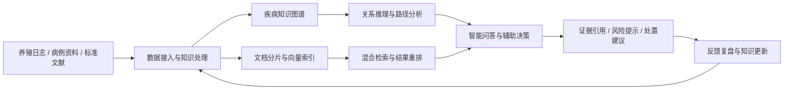
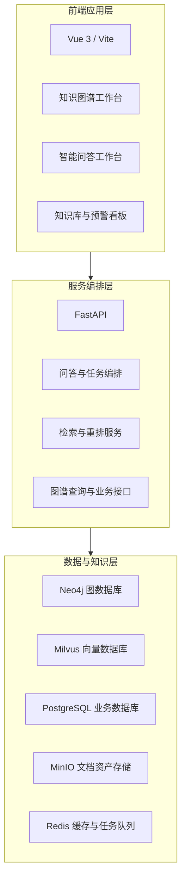
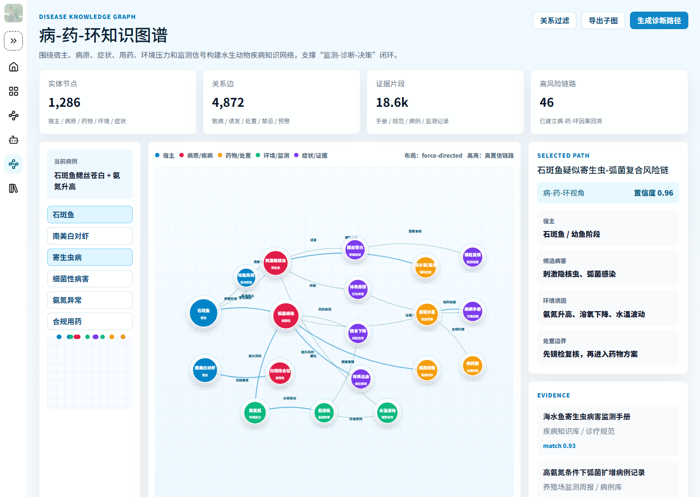
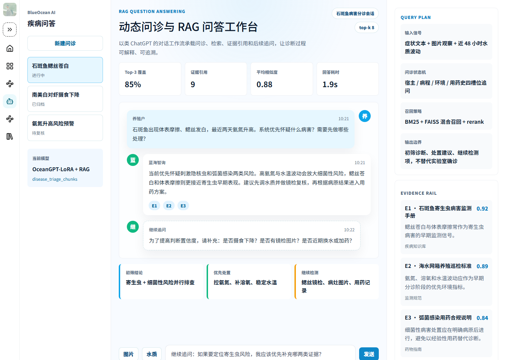
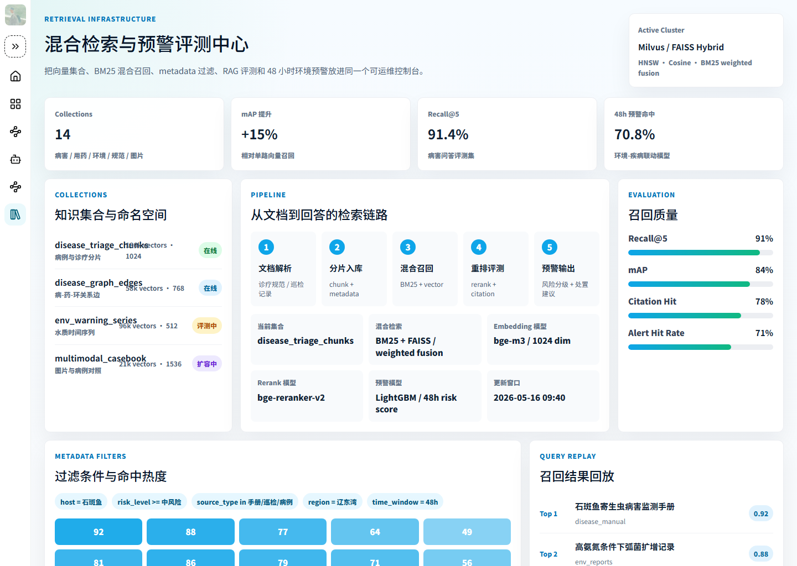

# 蓝海智询 | 水生动物疾病知识问答平台


蓝海智询是一个面向水产养殖场景的水生动物疾病知识问答与辅助决策平台。项目围绕鱼类疾病识别、病原分析、环境因子评估、处置方案推荐和知识资产管理，构建集知识图谱、RAG 问答、向量检索与风险预警于一体的智能知识服务体系，为养殖生产、基层渔技服务、疫病防控和科研教学提供统一的信息组织与决策支撑能力。

## 项目概述

在水产养殖过程中，疾病诊断往往同时依赖症状观察、水质指标、病原经验、用药规范和历史案例。传统资料分散在标准文献、诊疗手册、养殖日志和专家经验中，存在检索成本高、知识关联弱、处置链路不清晰等问题。蓝海智询以结构化知识组织为基础，将疾病知识图谱、多源知识库和智能问答能力整合到统一平台中，支持从信息检索、诊断辅助到风险预警的完整业务闭环。

## 核心能力

- **疾病知识图谱构建**：围绕宿主、疾病、病原、症状、药物、环境因子和防控措施建立结构化关联网络。
- **RAG 智能问答**：结合知识库检索、证据引用与上下文推理，输出可追溯的诊断分析和处置建议。
- **向量检索与混合召回**：支持文档分片、语义索引、关键词检索、重排评测和知识命中回放。
- **风险预警分析**：联动水温、溶氧、pH、氨氮、亚硝酸盐等环境指标，识别潜在疫病风险和干预优先级。
- **知识库运营管理**：支持知识接入、版本维护、数据分层、引用跟踪和效果评估，形成长期可维护的知识资产体系。

## 功能模块

| 模块 | 模块职责 | 关键能力 |
| --- | --- | --- |
| 综合态势总览 | 汇总平台运行状态、知识资产规模、问答热点与预警概况 | 首页驾驶舱、指标总览、任务入口 |
| 智能问答中心 | 面向疾病咨询与场景问诊提供多轮对话式知识服务 | 症状问询、证据引用、追问建议、处置输出 |
| 病-药-环知识图谱 | 展示疾病、病原、药物和环境因子之间的关系网络 | 图谱浏览、关系追踪、路径分析、关联定位 |
| 向量检索与知识库 | 管理知识切片、索引状态和检索质量，支撑问答召回 | 文档分片、向量索引、混合召回、检索评测 |
| 风险预警分析 | 结合环境数据与疾病诱因进行风险识别和预警提示 | 风险分级、异常指标识别、干预建议 |
| 专题知识空间 | 按疾病专题、诊疗任务和知识主题组织专业内容 | 专题入口、知识聚合、任务导航 |
| 平台运维与配置 | 管理系统基础配置、运行服务和工程环境 | 配置模板、部署编排、运行脚本、验证工具 |

## 业务闭环



## 系统架构



## 界面预览

### 病-药-环知识图谱


### 智能问答中心


### 向量检索与知识库


## 技术栈

- **前端**：Vue 3、Vite、TypeScript、Pinia、Ant Design Vue
- **可视化**：ECharts、图谱关系展示组件、指标看板组件
- **后端**：FastAPI、异步任务编排、接口路由与业务服务封装
- **知识工程**：文档解析、知识抽取、分片入库、向量化、混合检索、引用追踪
- **数据基础设施**：Neo4j、Milvus、PostgreSQL、Redis、MinIO
- **工程化能力**：Docker Compose、环境模板、初始化脚本、测试与验证脚本

## 快速开始

### 1. 启动前端

```powershell
cd web
pnpm install
pnpm dev --host 127.0.0.1 --port 5173
```

访问地址：

- 首页：`http://127.0.0.1:5173/`
- 专题空间：`http://127.0.0.1:5173/themes`
- 知识工作台：`http://127.0.0.1:5173/knowledge`
- 知识图谱：`http://127.0.0.1:5173/graph`
- 智能问答：`http://127.0.0.1:5173/agent`
- 向量检索：`http://127.0.0.1:5173/database`

### 2. 构建验证

```powershell
cd web
pnpm build
pnpm preview --host 127.0.0.1 --port 4175
```

### 3. 容器化部署

```powershell
docker compose up -d
```

如需生产环境配置，可结合 `.env.template`、`.env.prod.template`、`docker-compose.yml` 与 `docker-compose.prod.yml` 进行部署编排。

## 项目结构

```text
.
├── docs/                   # 项目文档与架构说明
├── docker/                 # 容器化相关资源
├── server/                 # 服务端接口与路由层
├── src/                    # 知识处理、配置与核心业务能力
├── test/                   # 测试与验证脚本
├── web/                    # Vue 前端应用
├── scripts/                # 初始化、迁移与运维脚本
├── data/                   # 数据目录说明与数据资产入口
├── README.md               # 项目说明
├── pyproject.toml          # Python 工程配置
├── package.json            # 前端与文档工程配置
└── docker-compose.yml      # 本地编排配置
```

## 应用场景

- 水产养殖场景下的疾病咨询与辅助诊断
- 基层渔技服务中的知识检索和处置建议支持
- 水生动物疫病防控中的风险识别与预警提示
- 科研与教学中的知识图谱展示、知识库构建与问答实验
- 面向行业项目的知识平台原型验证与后续工程化扩展

## 项目成果

- 构建面向水生动物疾病领域的知识问答平台整体方案，形成从知识组织到辅助决策的完整系统框架。
- 建立“病-药-环”知识图谱表达方式，实现疾病、病原、药物与环境因子的关联化组织。
- 完成智能问答、知识图谱、向量检索、预警分析等核心界面的前端系统化呈现。
- 形成涵盖前端应用、后端骨架、部署配置、知识工程和验证脚本的完整工程结构。
- 项目代码仓库：<https://github.com/GodCzy/buleocean>

## 后续规划

- 接入真实水生动物疾病知识库、病例数据、环境监测数据和行业标准资料。
- 完善知识抽取、实体消歧、关系审核和图谱增量更新流程。
- 接入实际大模型、Embedding 模型、重排模型与引用校验模块。
- 增强多模态输入能力，支持图片观察、病例上传与传感器数据联动分析。
- 完善权限管理、审计日志、专家审核和平台运维能力，支撑正式业务部署。

## 说明

当前仓库已提供蓝海智询平台的前端应用、服务骨架、知识工程结构与部署配置。平台中的知识图谱、智能问答、向量检索和风险预警能力可根据业务数据、模型服务和部署环境继续扩展与落地。
